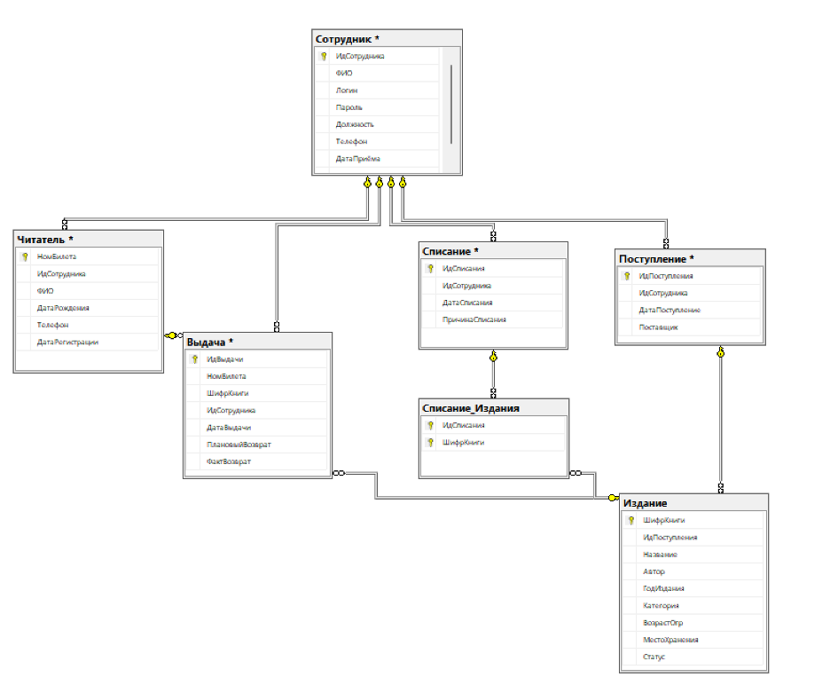

# Library Database Design

Реляционная база данных для библиотеки: 7 таблиц, 27 ограничений целостност, нормализация до 3НФ, связи 1:N и M:N.

## Что в проекте

- **sql/01_create_tables.sql** — DDL: 7 таблиц, первичные и внешние ключи, CHECK-ограничения, составной PK в связующей таблице
- **sql/02_insert_data.sql** — демонстрационные данные: сотрудники, читатели, издания, выдачи, списания
- **sql/03_sample_queries.sql** — примеры запросов: JOIN'ы, агрегации, оконные функции, работа с датами

## Схема

7 таблиц:

- **Сотрудник** — работники библиотеки (директор, библиотекари)
- **Читатель** — картотека, привязана к сотруднику, который зарегистрировал
- **Издание** — книги со статусом (в фонде / выдано / списано), возрастным ограничением и местом хранения
- **Выдача** — операции выдачи с датами и сроком возврата
- **Поступление** — закупки, привязаны к сотруднику
- **Списание** — акты списания с причиной
- **Списание_Издания** — связующая таблица M:N с составным первичным ключом

## Ограничения целостности

Бизнес-правила, реализованные на уровне БД:

- Статус издания принимает только значения: «В фонде», «Выдано», «Списано»
- Возрастное ограничение — из фиксированного списка: 0+, 6+, 12+, 16+, 18+
- Причина списания: «Утеряно», «Испорчено», «Изношено»
- Дата возврата строго позже даты выдачи
- Возраст читателя не меньше 6 лет
- Год издания не позже текущего
- Логин и телефон сотрудника уникальны

## Демонстрационные данные

Скриншоты заполненных таблиц — в папке [diagrams/sample_data/](diagrams/sample_data/).

## Стек

Microsoft SQL Server, T-SQL
